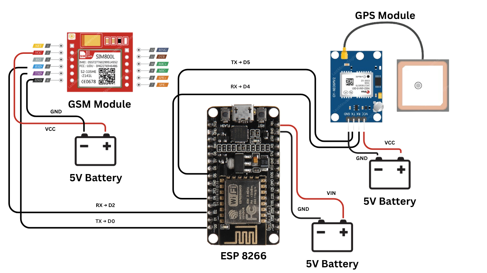

# 🐄 Cattle GPS Tracking System with GSM Alerts

A real-time GPS tracking system for cattle using **ESP8266**, **GSM**, and **GPS** modules.  
It sends the cattle's location via SMS whenever:
- You **call** the GSM module's number.
- You **send** the SMS command `"Getloc"`.
- Automatically every **30 minutes**.

## 📌 Features
- Send current GPS location when receiving a call.
- Respond to `Getloc` SMS command with location.
- Automatic location updates every 30 minutes.
- Secure: Only registered numbers can request location.

---

## 🧩 Components Used

| Component          | Quantity | Description |
|--------------------|----------|-------------|
| ESP8266 NodeMCU    | 1        | Microcontroller |
| SIM800L GSM Module | 1        | Sends/receives SMS & calls |
| Neo-6M GPS Module  | 1        | Gets latitude & longitude |
| 5V Power Supply    | 1        | Stable external power |
| Jumper Wires       | Several  | For connections |
| Antennas           | 2        | For GSM & GPS reception |

---

## 🔌 Wiring Diagram

| Module | ESP8266 Pin | 
|--------|-------------|
| GSM RX | D2          | 
| GSM TX | D0          |  
| GPS RX | D4          | 
| GPS TX | D5          |  
| Power  | VIN → 5V    |
| GND    | GND         |

**Wiring Diagram Image:**  

---

## 🧠 How It Works
1. On startup, GSM & GPS modules initialize.
2. Every **30 mins**: fetch GPS location & send via SMS.
3. **Incoming call**:
   - Call is auto-rejected.
   - Location is sent back via SMS.
4. **SMS "Getloc"**:
   - Replies with Google Maps link if from registered number.
5. Location format:  
https://www.google.com/maps?q=LAT,LNG

## 🚀 How to Use
1. Insert a SIM card into GSM module.
2. Upload the code to ESP8266.
3. Power up the system.
4. Wait for GPS to lock (~30s outdoors).
5. Get location:
- Call the module’s number → Location SMS sent.
- Send SMS `"Getloc"` → Location SMS sent.
6. Receive automatic location updates every 30 mins.